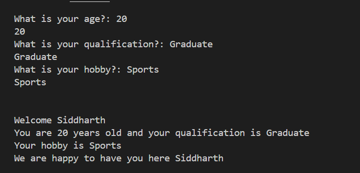

# Personal Information Program

## Project Overview

This project is a simple Python program that collects personal information from a user and displays a friendly welcome message.

The program asks the user for:

* Name
* Age
* Qualification
* Hobby

After collecting the information, it displays a personalized introduction message using formatted output.

---

## Objectives

* Learn how to use the `input()` function.
* Store user information in variables.
* Practice using different data types such as strings and integers.
* Display output using the `print()` function.
* Use f-strings for formatted output.
* Understand the flow of a basic Python program.

---

## Technologies Used

* Python 3

---

## Project Structure

```text
Personal-Information-Program/
│
├── README.md
├── personal_intro.py
├── requirements.txt
└── screenshot.png
```

---

## Setup Instructions

### 1. Install Python

Download and install Python from the official website:

https://www.python.org/downloads/

While installing, make sure to check:

✔ Add Python to PATH

### 2. Clone the Repository

```bash
git clone https://github.com/your-username/personal-information-program.git
```

Or download the ZIP file and extract it.

### 3. Run the Program

Open a terminal in the project folder and run:

```bash
python personal_intro.py
```

---

## Code Explanation

### Variables Used

| Variable        | Purpose                         |
| --------------- | ------------------------------- |
| `name`          | Stores the user's name          |
| `age`           | Stores the user's age           |
| `qualification` | Stores the user's qualification |
| `hobby`         | Stores the user's hobby         |

### Concepts Used

* Variables
* User Input (`input()`)
* Type Casting (`int()`)
* Formatted Strings (`f-strings`)
* Output Display (`print()`)

---

## Program Flow

1. Display a welcome heading.
2. Ask the user for their name.
3. Ask the user for their age.
4. Ask the user for their qualification.
5. Ask the user for their hobby.
6. Store all responses in variables.
7. Display a personalized welcome message.

### Program Algorithm

```text
Start
  ↓
Display Welcome Message
  ↓
Get Name Input
  ↓
Get Age Input
  ↓
Get Qualification Input
  ↓
Get Hobby Input
  ↓
Display User Information
  ↓
End
```

---

## Sample Output

```text
                        Welcome to personal information

What is your name?: Siddharth
Siddharth

What is your age?: 20
20

What is your qualification?: Graduate
Graduate

What is your hobby?: Sports
Sports


Welcome Siddharth
You are 20 years old and your qualification is Graduate
Your hobby is Sports
We are happy to have you here Siddharth
```

---

## Testing Evidence

### Test Case 1

**Input**

* Name: Siddharth
* Age: 20
* Qualification: Graduate
* Hobby: Sports

**Expected Result**

The program should display all user details correctly in a personalized welcome message.

**Status:** ✅ Passed

---

### Test Case 2

**Input**

* Name: Sid
* Age: 21
* Qualification: BSc IT
* Hobby: Coding

**Expected Result**

The program should display Sid's information correctly in a personalized welcome message.

**Status:** ✅ Passed

---

## What I Learned

Through this project, I learned:

* How to install and run Python programs.
* How to use the `input()` function to collect user data.
* How to store information using variables.
* How to convert string input into integers using `int()`.
* How to use f-strings for dynamic output formatting.
* How a Python program executes step by step.
* Basic project documentation and GitHub structure.

---

## Requirements

No external libraries are required for this project.

### requirements.txt

```text
# No external dependencies required
```

---

## Screenshot

The screenshot below demonstrates the successful execution of the program.




## Author

**Siddharth Gupta**

Week 1: Python Basics – Personal Information Program
